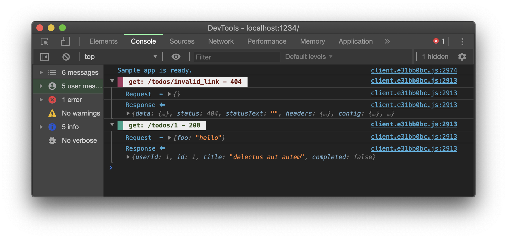
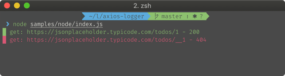

# @lollipop-onl/axios-logger

`@lollipop-onl/axios-logger` is a cute logger for [Axios](https://github.com/axios/axios).

## Installation

```sh
$ yarn add -D @lollipop-onl/axios-logger
# or
$ npm i -D @lollipop-onl/axios-logger
```

## Usage

```ts
import axios from "axios";
import AxiosLogger from "@lollipop-onl/axios-logger";

const BASE_URL = "https://jsonplaceholder.typicode.com";

const request = axios.create({
  baseURL: BASE_URL,
  responseType: "json"
});
const logger = new AxiosLogger({
  baseURL: BASE_URL
});

request.interceptors.response.use(...Logger.response);
```

### Browser console



### Node.js console



## Documentation

### `constructor`

```ts
const logger = new AxiosLogger({
  baseURL: 'https://jsonplaceholder.typicode.com';
  platform: 'client';
  showRequest: true;
  showResponse: true;
});
```

### `baseURL` (`boolean`)

default: `''`

Here you specify the base URL of the main request. It is omitted from the displayed request URL (Only client).

### `platform` (`'client' | 'node' | 'nuxt'`)

default: Automatic discrimination between `client` and `node`

This parameter is affected for log style.

If `nuxt` is specified, it will be executed according to the result of `process.client/server`.

```ts
// plugins/axios.ts
import AxiosLogger from "@lollipop-onl/axios-logger";

export default ({ $axios, isDev }) => {
  const logger = new AxiosLogger({
    platform: "nuxt",
    quiet: !isDev
  });

  $axios.onResponse(response => {
    logger.response(response);
  });

  $axios.onResponseError(response => {
    logger.response(response);
  });
};
```

### `showRequest`/`showResponse` (`boolean`)

default: `false`

When those parameters are enabled, request/response logs will be displayed on Node.js.

### `quiet` (`boolean`)

default: `false`

When this parameter is enabled, all logs will not be displayed.

### Override configurations

You can change configuration directly.

```ts
const logger = new AxiosLogger();

logger.showResponse = true;
logger.quiet = true;
```

## Licence

MIT
